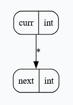
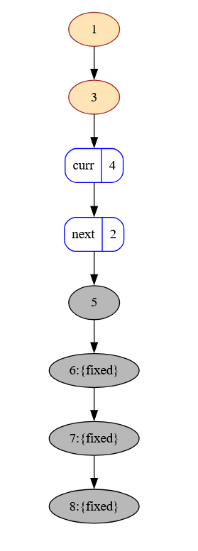

# Grabapl - A Graph-Based Programming Language

Grabapl is a framework for creating **gra**ph-**ba**-sed **p**rogramming **l**anguages with
static guarantees.

**Elevator pitch**:
* **Program state is a graph**
* **Client-definable type system** for node and edge weights
* **Statically typed user-defined operations**: expected nodes and edges are guaranteed to exist at runtime, with their
  values being of the expected types.
    * No explicit loops: recursion only.
* **First-class node markers**: No more explicit `visited` or `seen` sets!
* **WebAssembly**: Grabapl can be compiled to WebAssembly.
* **Ships with a fully-fledged example online IDE**:
    * <a href="https://skius.github.io/grabapl/playground/" target="_blank">Playground</a>
    * Interactive, visual runtime graph editor to create inputs for the program
    * Visualization of user-defined operations' abstract states
    * Automatic visualization of a runtime execution's trace
    * Text-based user-defined operations:
        * Visualize abstract states with `show_state()`
        * Capture trace snapshots with `trace()`
        * Syntax highlighting
        * Useful error messages

See [https://crates.io/crates/grabapl](https://crates.io/crates/grabapl) for more information.

An example client is documented at [`grabapl_template_semantics`](https://crates.io/crates/grabapl_template_semantics).
This is the one used for the online playground.

## Features
### Graph-based state and operations
The entire program data state is a single, directed, global graph with node and edge weights.

Operations are defined in terms of *abstract subgraphs* whose node and edge weights are the *types*
of their respective runtime values.

### Static Guarantees
The framework guarantees that at any point during any execution, the abstract subgraph of the
currently executing operation is *sound*:
1. All nodes and edges present in the abstract subgraph are present in the runtime graph.
2. The runtime node and edge values are of the types that are asserted by the abstract subgraph.

### Pluggable Semantics
Grabapl is generic over a *semantics*. Client semantics can define the following:
1. **The type system** of node and edge weights, which includes:
    * The runtime values of nodes and edges.
    * The types of nodes and edges in the abstract subgraph.
    * Subtyping relations between types.
    * Joins between types.
1. Hardcoded, **built-in operations** in Rust (or any other language via FFI).
1. Hardcoded, **built-in queries** in Rust (or any other language via FFI).

### Incremental, Visual-Aware User-Defined Operations
Grabapl provides a builder to create type-safe user-defined operations in an incremental way, supporting
arbitrary frontends with minimal effort.

Operations are built from a stream of *messages* sent to the builder.
At any point, the frontend can query the builder for the current abstract state of the operation,
which considers any messages that have been sent so far.
Importantly, it is not necessary for the sent messages to already constitute a complete operation.
The returned abstract state is
trivially visualizable as a graph, which
can be used to provide immediate feedback to any end-users who are defining operations.

The text-based frontend in the <a href="https://skius.github.io/grabapl/playground/" target="_blank">example online IDE</a>
is just a parser that turns the parsed AST into messages for the builder. See the
[`grabapl_syntax`](https://crates.io/crates/grabapl_syntax/) crate for more details.

Here is an example of a visualized abstract state at some point in a bubble sort operation:

### Visualizable Runtime Execution Tracing
The executor supports tracing the runtime execution of a program via snapshots.

Every snapshot can be visualized as a graph. Below is a sample snapshot during the execution of
bubble sort ([source program](https://github.com/skius/grabapl/blob/main/example_clients/online_syntax/example_programs/tracing_normal_bubble_sort_variant_b.gbpl)):

**Legend**:
* Named, white nodes with blue outline:
    * Nodes that are part of the abstract subgraph of the currently executing operation at the time of the snapshot.
    * The names are as visible in the stack frame of the operation that took the snapshot.
* Orange nodes: Nodes that are bound to some operation in the call stack other than the currently executing operation.
* Gray nodes: Nodes that are not (yet) part of the abstract subgraph of any operation in the call stack.
* Anything in `{curly braces}`: The node markers that are currently applied to the node.

These traces can be animated together to visualize the execution of a program.
This is what the <a href="https://skius.github.io/grabapl/playground/" target="_blank">playground</a> does
when running a program with `trace()` instructions.
See below for the full animated trace of bubble sort ([source program](https://github.com/skius/grabapl/blob/main/example_clients/online_syntax/example_programs/tracing_normal_bubble_sort_variant_b.gbpl)):

<https://github.com/user-attachments/assets/05301f5c-f7a1-4001-bf23-e8f0739ffa96>

